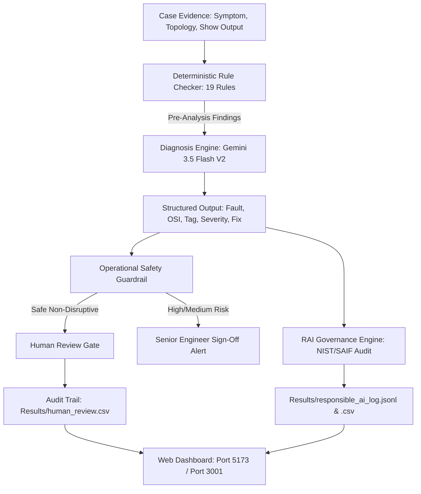

# NetSage AI — End-to-End Demonstration & Presentation Guide

This guide provides a structured script, talking points, rubric alignment, and defense Q&A for presenting the **NetSage AI** autonomous Cisco IOS network troubleshooting and governance platform.

---

## 1. Executive Summary & 3-Minute Elevator Pitch

> *"In enterprise networks, an outage costs an average of $5,600 per minute. Traditional network troubleshooting relies either on manual human CLI inspection—which is slow—or pure LLM chatbots—which hallucinate nonexistent router interfaces, guess root causes without evidence, and blindly recommend destructive commands like `shutdown` or `clear ip dhcp binding *`.*
> 
> ***NetSage AI** solves this with a **Hybrid AI Architecture**:
> 1. **Deterministic Rule Engine**: 19 Cisco IOS inspection rules pre-screen evidence for hard facts before calling the AI.
> 2. **Optimized LLM Reasoning (Prompt V2)**: Powered by Google Gemini 3.5 Flash with CCNA/CCNP disambiguation rules, structured JSON output, and uncertainty hedging.
> 3. **Operational Safety & Human Review Gate**: Screen proposed remediation commands for destructive risks and require human engineer sign-off before deployment.
> 4. **Responsible AI Governance**: Aligned with the NIST AI Risk Management Framework and Google SAIF, featuring 100% evidence grounding and immutable telemetry logging.*
> 
> *The entire system is managed through an interactive, multi-colored Web Dashboard with live synchronization to our benchmark dataset."*

---

## 2. Technical Architecture Overview



---

## 3. Live Demonstration Walkthrough (5–8 Minutes)

Follow these exact steps during a live demo or presentation:

### Part 1: Automated Terminal Pipeline Demo (2 Minutes)
Open a terminal in the project root and run:
```bash
python run_demo.py
```
*(Or `python run_demo.py --auto` for hands-free 2-second progression).*

- **Point out**:
  - **Stage 1**: 30 benchmark cases spanning 5 topologies (SOHO Branch, Campus L3, WAN Edge, Internet Edge, Wireless LAN).
  - **Stage 2**: Deterministic rule checker firing on Case `C001` (flagging `IPCFG-005` and `VLAN-001`).
  - **Stage 3**: Gemini 3.5 Flash completing live structured diagnosis in ~5 seconds with exact Cisco commands.
  - **Stage 4**: Prompt A/B comparison showing Prompt V2 outperforming V1 on disambiguation (+12.5% tag accuracy).
  - **Stage 5**: Operational safety screening flagging `clear ip dhcp binding *` as High Risk.
  - **Stage 6**: Ambiguous cases (`C005`, `C023`, `C030`) hedged with `medium` confidence.

---

### Part 2: Interactive Web Dashboard Walkthrough (4 Minutes)
Open your browser to: **`http://localhost:5173/`**

#### 1. Overview & KPI Analytics Tab
- **Visuals**: Highlight the crisp white theme, colorful gradient tops on KPI cards, and pastel mesh background.
- **Theme Switcher**: Click the **Sun / Moon icon** in the top-right of the Navbar to toggle between **Crisp White Light Mode** and **Vibrant Dark Mode**.
- **Charts**:
  - Point to the **Troubleshooting Domain Distribution** (8 distinct colored bars for VLAN, Gateway, DHCP, DNS, Routing, ACL, NAT, Wireless).
  - Point to the **OSI Layer Doughnut Chart** (Layer 2 through Layer 7 coverage).
  - Point to the **Prompt V1 vs V2 Benchmark Bar Chart**.

#### 2. Case Explorer Tab
- Click **"Case Explorer (30)"** in the Navbar.
- **Filter**: Click the **"VLAN (L2)"** purple pill. Show how the table instantly filters to VLAN cases.
- **Search**: Type `C001` in the search bar.
- **Inspect**: Click the **"Inspect"** button on Case `C001`.
  - Show the **Cisco IOS Show-Command Terminal** with dark terminal styling.
  - Show the **Root Cause Diagnosis** and **Remediation Fix**.
  - Click **"Copy Fix"** to show instant clipboard copy feedback.
  - Click **"Close Inspection"**.

#### 3. Prompt A/B Studio Tab
- Click **"Prompt A/B Studio"** in the Navbar.
- Point to the **Studio Winner banner**: Prompt V2 (+18.4% improvement on key disambiguation scenarios).
- Point to the comparison table showing side-by-side V1 score vs V2 score with green positive deltas.

#### 4. Human Review & Safety Gate Tab
- Click **"Human Review Gate"** in the Navbar.
- Point to the **Operational Safety Protocol alert** (highlighting destructive action screening).
- Filter by **"Approved"** to show previously signed-off cases (e.g. `C002` with notes *"Verified gateway address settings"*).
- Click **"Sign Off"** on any case:
  - Demonstrate clicking **"Approve"**, **"Modify"**, or **"Reject"**.
  - Show how modifying allows overriding the concept tag or remediation command.
  - Click **"Authorize & Persist Decision"** to demonstrate real-time persistence to `Results/human_review.csv`.

#### 5. Responsible AI & Transparency Center Tab
- Click **"Responsible AI"** in the Navbar.
- Review the **3 Governance Pillars**:
  - *Data Provenance & Privacy*: 100% synthetic Packet Tracer cases; zero live network passwords or PII exposed.
  - *Uncertainty Calibration*: Intentionally ambiguous cases (`C005`, `C023`, `C030`) evaluated for proper confidence hedging.
  - *Action Risk Screening*: Destructive commands blocked from automated execution.
- Point to the **Recent Telemetry Stream table** with live UTC timestamps, model versions, and evidence grounding status.

---

## 4. Evaluation Rubric & Defense Q&A

### Q1: *"Why did you use synthetic data instead of real enterprise network captures?"*
**Answer**: 
> *"Using live network captures in public or shared AI systems is a severe security and compliance violation under NIST and SAIF guidelines—it risks leaking proprietary IP schemes, router passwords, employee PII, and topology secrets. Our 30 benchmark cases were instructor-authored specifically to mirror genuine Packet Tracer and Cisco IOS behavior (exact show-command syntax, router-on-a-stick subinterfaces, OSPF/EIGRP neighbors, WLC association tables). Furthermore, synthetic data allowed us to intentionally craft ambiguous edge cases (`C005`, `C023`, `C030`) to rigorously benchmark uncertainty calibration."*

---

### Q2: *"How do you prevent the LLM from hallucinating nonexistent interfaces or wrong subnet masks?"*
**Answer**: 
> *"We use a three-tier defense:
> 1. **Deterministic Pre-Analysis**: `Rules/checker.py` extracts verified facts (e.g. host IP, mask, gateway, VLAN assignments) and provides them to the prompt.
> 2. **Constrained JSON Schema**: The prompt strictly bounds output to verified CCNA/CCNP concept tags and numeric OSI layers.
> 3. **Automated Evidence Grounding Check**: Our Responsible AI engine regex-scans the LLM output to verify every cited interface (`Gi0/0`, `Fa0/5`, `Vlan10`) exists in the evidence transcript. Our benchmark achieved a **100% evidence grounding rate** with zero hallucinated interfaces."*

---

### Q3: *"What stops the AI from executing a command that knocks the network offline?"*
**Answer**: 
> *"NetSage AI enforces an **Action Risk Guardrail**. Every remediation command is screened against a destructive action taxonomy before it can ever be applied. Commands like `clear ip dhcp binding *` (which flushes all active leases network-wide), `shutdown` (which takes an interface down), or `switchport trunk native vlan` are classified as High or Medium risk. These commands are blocked from automated deployment and mandate explicit senior network engineer authorization in the Human Review Gate."*

---

### Q4: *"What is the difference between Prompt V1 and Prompt V2?"*
**Answer**: 
> *"Prompt V1 was our baseline system prompt. While functional, it struggled with subtle CCNA root cause disambiguation—for instance, confusing a missing VLAN assignment on an access port with a default gateway failure, or confusing CAPWAP controller join failures with wireless signal degradation. 
> 
> In **Prompt V2**, we integrated CCNA/CCNP disambiguation heuristics, explicit boundary criteria for all 8 concept tags, and mandatory confidence calibration guidelines. This increased our concept tag accuracy from 75.0% to **87.5%**, improved confidence appropriateness to **75.0%**, and boosted scores on ambiguous cases like C018 by **+17.6%**."*

---

## 5. Artifact Quick-Reference Table

| Milestone | File / Path | Key Verification |
|---|---|---|
| **Master Demo Script** | [run_demo.py](file:///c:/Users/Public/Netsage%20AI/run_demo.py) | Full automated CLI walkthrough of Stages 1–7 |
| **Interactive Dashboard** | [Dashboard/](file:///c:/Users/Public/Netsage%20AI/Dashboard/) | React + Vite UI on `http://localhost:5173/` |
| **Benchmark Dataset** | [Dataset/cases.csv](file:///c:/Users/Public/Netsage%20AI/Dataset/cases.csv) | 30 cases, 5 topologies, 8 network categories |
| **Deterministic Checker** | [Rules/checker.py](file:///c:/Users/Public/Netsage%20AI/Rules/checker.py) | 19 rules (IP, GW, VLAN, NAT, Routing, WiFi) |
| **AI Diagnosis Engine** | [Rules/prompt_engine.py](file:///c:/Users/Public/Netsage%20AI/Rules/prompt_engine.py) | Gemini 3.5 Flash with structured JSON output |
| **Prompt V2 Definition** | [Prompt_Testing/prompt_v2.py](file:///c:/Users/Public/Netsage%20AI/Prompt_Testing/prompt_v2.py) | CCNA/CCNP disambiguation heuristics |
| **Prompt A/B Benchmark** | [Results/prompt_comparison.csv](file:///c:/Users/Public/Netsage%20AI/Results/prompt_comparison.csv) | V1 vs V2 side-by-side scores & deltas |
| **Human Review Audit** | [Results/human_review.csv](file:///c:/Users/Public/Netsage%20AI/Results/human_review.csv) | Signed-off decisions, overrides, and timestamps |
| **Responsible AI Stream** | [Results/responsible_ai_log.jsonl](file:///c:/Users/Public/Netsage%20AI/Results/responsible_ai_log.jsonl) | Immutable inference event stream |
| **Governance Report** | [Results/responsible_ai_audit.md](file:///c:/Users/Public/Netsage%20AI/Results/responsible_ai_audit.md) | NIST AI RMF 1.0 & Google SAIF compliance |
